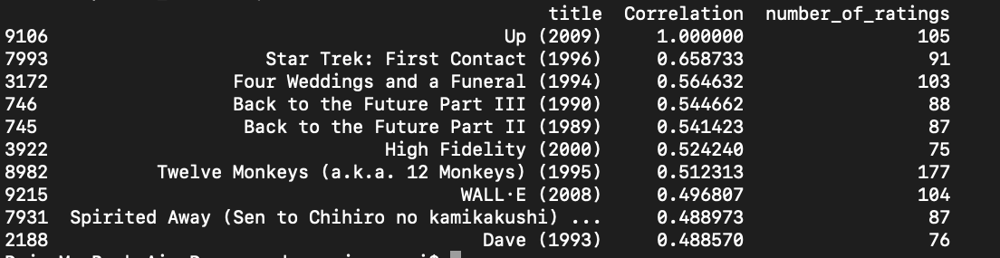

# Akin
Akin is a purely statistical project which correlates a movie with other movies from a dataset based on ratings and popularity and shows the closest positively correlated movies for a given movie from the dataset.   


## Results

Here is a list of movie similar to the movie **Up (2009)** and their respective :

 

 


## Installations and Setup


Use the package manager [pip](https://pip.pypa.io/en/stable/) to install the dependencies.


```bash
pip3 install -r requirements.txt
```
## Structure of the project
- The **corr.py** file contains the main script which gives us our results. 
- Please explore the structure of the datasets in the **movies.csv** and **ratings.csv** files. 


## Usage
Feel free to alter the movie for which you would like to see positive correlations. This can be done by replacing the given excerpt in the **corr.py** file with a movie name from the **name column** in the **movies.csv** file.

```python
movie_user_rating = movie_matrix['Up (2009)']
```
Make sure you copy the name exactly as given in the **movies.csv** file.

After choosing the movie, to see the results run
```python
python3 corr.py
```

## Contributing
Pull requests are welcome. For major changes, please open an issue first to discuss what you would like to change.


